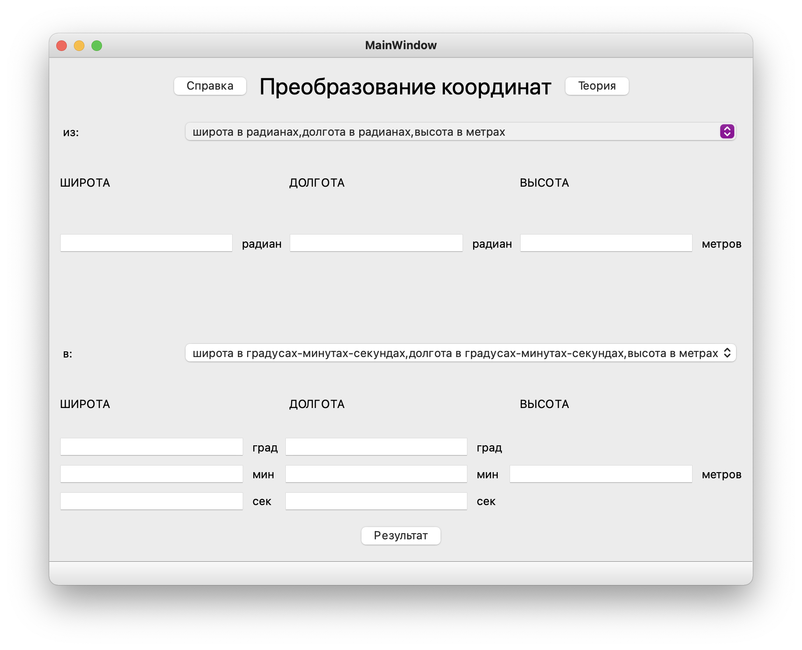

# Инструкция по применению

1. Выберете начальный и конечный форматы координат

2. Введите значения в соответствующие поля

__Важно__: если Вы выбрали начальный формат _'градусы-минуты-секунды'_, то при указании отрицательного значения широты/долготы знак '-' нужно прописывать в __каждом__ поле: _градусы, минуты, секунды_

3. Нажмите на кнупку __*результат*__

4. Краткая теоретическая справка появится при нажатии кнопки __*теория*__

# Общие сведения 

__*Широту*__ принято отсчитывать от _экватора на север_. 
Таким образом, __*широта*__ точек, лежащих _в северном полушарии_, __*положительна*__, а _в южном_ — __*отрицательная*__. 
__*Широта*__ любой точки _экватора_ равна __*0°*__, _северного полюса_ — __*+90°*__, _южного полюса_ — __*−90°*__.

В соответствии с международным соглашением, __*меридиану*__, который проходит через __Гринвичскую обсерваторию__ (Лондон, Великобритания) было присвоено значение __*0°*__ долготы, иными словами, он был избран в качестве точки отсчёта __*долготы*__ на земном шаре. 
__*Долгота*__ других мест измеряется как угол на восток или запад от нулевого меридиана, в диапазоне от __*0°*__ до __*+180°*__ на восток и от __*0°*__ до __*−180°*__ на запад.

__*Высота*__ - кратчайшее расстояние до поверхности эллипсоида (грубо говоря, высота над/под уровнем моря).

